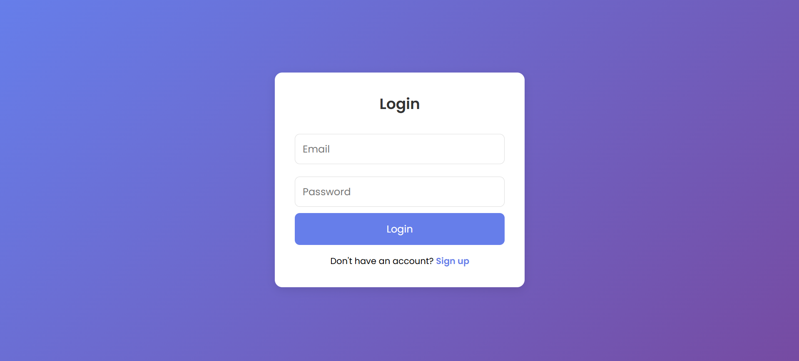
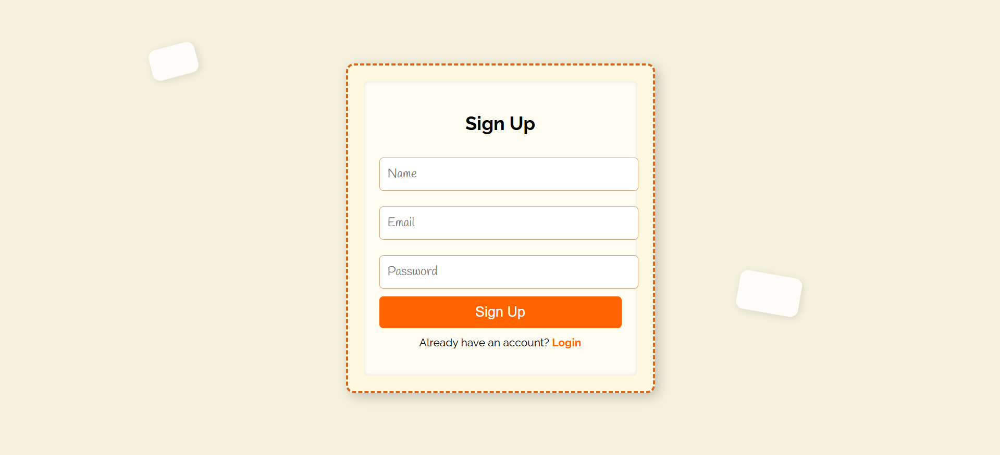

### **Project Description**
This is a simple, full-stack Notes Application that allows users to add and view notes. The project is experimental and just for learnig purposes.The backend is powered by Express and a PostgreSQL database for data persistence, while the frontend is built using Vanilla JavaScript, HTML, and CSS. The application is deployed on Render , a cloud platform.

---

### **Table of Contents**
- [Installation](#installation)
- [Usage](#usage)
- [Features](#features)
- [Screenshots](#screenshots)
- [Contributing](#contributing)


---

### **Installation** <a name="installation"></a>
To get this project up and running locally on your machine, follow the steps below:

1. **Clone the repository** to your local machine using Git:
   ```bash
   https://github.com/AggeSak/NotesOnline.git

2. **Usage** <a name="usage"></a>
To use this project navigade with cd command on the frontend dataset and backend directory

3. ### **Features** <a name="features"></a>

4. ### **Images of the Website** <a name="screenshots"></a>

<p align="center">
  
  
</p>


